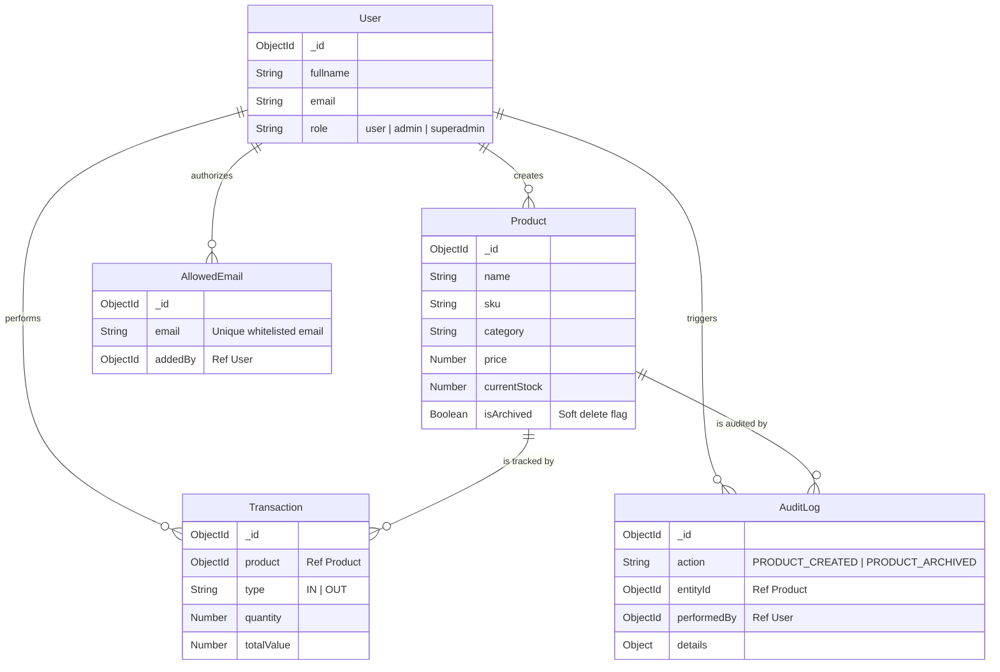

# Inventory & Stock Tracker

[](https://inventory.cyberanzen.icu/)

**🌐 Live Site**: [https://inventory.cyberanzen.icu/](https://inventory.cyberanzen.icu/)

A comprehensive, full-stack Inventory and Stock Tracking system built with the MERN stack. It features a modern, glassmorphic UI, robust role-based access control, a background job queue for processing images, and secure local file storage using MinIO.

---

## 🏗 Total Architecture

The application is built on a scalable, microservices-ready architecture:

### 1. Frontend (Web)
- **Framework**: React with Vite
- **Styling**: Tailwind CSS (with custom CSS variables for full glassmorphism, dynamic gradients, and backdrop blurs)
- **State Management**: React Context API (`Appcontext` and `ThemeContext`)
- **Routing**: React Router DOM (protected routes based on user roles)
- **Performance**: Implementation of `@tanstack/react-virtual` for infinitely scrolling UI components (Table & Grid) to prevent OOM errors with large datasets. `react-select/creatable` for debounced fluid search.
- **Key Features**: 
  - Responsive Dashboard with Recharts
  - Complete Product CRUD with image uploads
  - Ledger Stream (Transactions) for IN/OUT stock tracking
  - Role-based User Management panel (Superadmin only)

### 2. Backend (API)
- **Framework**: Node.js & Express.js
- **Database**: MongoDB (using Mongoose for object modeling and transactions)
- **Caching**: Redis-backed caching strategies for high-frequency endpoints (`/categories`).
- **Authentication & Security**: JWT (JSON Web Tokens) with HttpOnly cookies, Bcrypt password hashing, and a strict **Email Allowlist (Pending Invites)** guard preventing unauthorized signups and Google OAuth logins.
- **Role-Based Access Control (RBAC)**: Middleware enforcing `user`, `admin`, and `superadmin` privileges.
- **Media Storage**: MinIO (S3-compatible object storage) for hosting product and profile images. Fallback to local file system if disabled.
- **Background Jobs**: BullMQ backed by Redis for asynchronous image processing (resizing, optimizing) to prevent blocking the main thread during heavy uploads.

---

## 🗄 Entity Relationship & Data Model (ERD)

The system relies on a closely coupled data model using MongoDB references and soft deletion to preserve financial audit history.



---

## ⚡ Caching & Performance Strategies

To ensure the application performs optimally even with tens of thousands of products:
1. **Redis Category Cache**: A dedicated `cacheService.js` automatically fetches all unique categories from the database and loads them into a Redis cache on server startup. It enforces a 1-hour TTL.
2. **Cache Invalidation**: Whenever an Admin creates or updates a product, the backend invalidates the Redis `categories_cache` ensuring the next request re-syncs the dropdowns instantly.
3. **Backend Pagination**: The `/api/products` and `/api/users` endpoints enforce page and limit caps directly at the MongoDB layer (`.skip().limit()`), preventing massive data dumps.
4. **Frontend Virtualization**: We utilize a sliding window approach (`@tanstack/react-virtual`). The DOM only renders the specific ~15 items currently visible on the screen. As you scroll, the nodes are recycled, yielding zero UI lag and no OOM crashes.

---

## 📡 API Details

### Authentication (`/api/auth`)
- `POST /register`: Register a new user
- `POST /login`: Authenticate and receive JWT cookie
- `POST /logout`: Clear JWT cookie
- `GET /check`: Verify current authentication state

### Users & Access Control (`/api/users`) - *Requires Admin / Superadmin*
- `GET /`: List all users
- `POST /`: Create a new user manually
- `PUT /:id`: Update user details (name, email, password)
- `PATCH /:id/role`: Update a user's role (admin/user)
- `DELETE /:id`: Delete a user
- `GET /allowlist/emails`: List all pending invited/authorized emails
- `POST /allowlist/bulk`: Bulk authorize emails (comma or newline-separated)
- `DELETE /allowlist/:id`: Revoke an email's authorization from the allowlist

### Products (`/api/products`) - *Protected*
- `GET /`: Get all products (supports `?search`, `?category`, `?lowStock`)
- `GET /:id`: Get single product details + recent transactions
- `POST /`: Create a new product (Admin only, supports image upload)
- `PUT /:id`: Update product (Admin only, supports image upload)
- `DELETE /:id`: Delete product and its transactions (Admin only)

### Transactions (`/api/transactions`) - *Protected*
- `GET /`: Get ledger of all IN/OUT movements
- `POST /`: Record a new stock movement (IN or OUT)

### Dashboard (`/api/dashboard`) - *Protected*
- `GET /stats`: Get high-level KPI metrics (Total products, total valuation, low stock alerts, ledger stream)

---

## 🚀 Steps to Run

### Option 1: Docker (Recommended)
The easiest way to run the entire stack (MongoDB, Redis, MinIO, Backend, and Frontend) is using Docker Compose.

1. **Install Docker Desktop**.
2. Run the following command in the root directory:
   ```bash
   docker-compose up -d --build
   ```
3. **Access the Apps**:
   - Single Entry Point (Nginx API Gateway): `http://localhost:3010`
   *(All internal services like Backend API and MinIO are intentionally blocked from host access for security)*
4. **Initial Login**:
   - Use the default superadmin credentials defined in `docker-compose.yml` or your `.env`.

### Option 2: Native Setup (Development)

**Prerequisites**: Node.js (v18+), MongoDB running locally (port 27017), Redis running locally (port 6379), and optionally MinIO (port 9000).

1. **Backend Setup**:
   ```bash
   cd Backend
   npm install
   # Create a .env file based on .env.example
   npm run dev
   ```

2. **Frontend Setup**:
   ```bash
   cd Web
   npm install
   npm run dev
   ```

3. **Access**: Navigate to `http://localhost:5173` in your browser.

---

## 🎨 UI/UX Philosophy
The entire application utilizes a unified **Glassmorphism** design language. By extensively utilizing CSS `backdrop-filter: blur()`, translucent surfaces, and rich dynamic ambient gradients, the UI provides a sense of depth, hierarchy, and extreme modernity.
